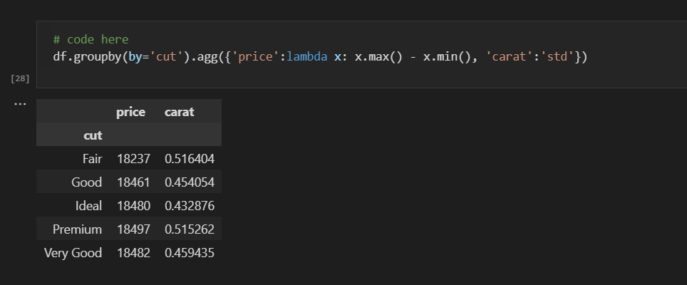

# DS-SanberCode
> Documentation of Data Science Python Class from [SanberCode Course](sanbercode.com).

## Table of contents
* [General info](#general-info)
* [Course content](#course-content)
* [Screenshots](#screenshots)
* [Technologies](#technologies)
* [Status](#status)
* [Author](#author)

## General info
Documentation of Data Science Python Class from [SanberCode Course](sanbercode.com). This course covered basic technical skill to learn data science. For example, understand data science, analyze data exploration, and apply basic machine learning.

## Course content
### Week 01 - Python Introduction 
* Hello Python
* Functions, Method, and Getting Help
* Logic Control Flow and Loop
* Python List dan Dictionary
* Descriptive Statistics

### Week 02 - Pandas
* Pandas Introduction
* Indexing and Transformation Data
* Reshaping Data
* Grouping Data
* Merging DataFrame

### Week 03 - Data Visualization
* Matplotlib Introduction
* Custom Visualization
* Multiple Plots
* Quantitative Comparison
* Seaborn Introduction

### Week 04 - Exploratory Data Analysis
* Data Types, Handling Missing Value, Handling Outlier
* Univariate, Bivariate, Multivariate Analysis
* Machine Learning (Unsupervised, Clustering)
* Final Project

## Screenshots

## Technologies
* [Python](www.python.org/downloads) - version 3.9.7
* [Jupyter Notebook](jupyter.org/install)

## Library
* [Matplotlib](pypi.org/project/matplotlib) - version 3.4.3
* [Numpy](pypi.org/project/numpy) - version 1.20.2
* [Pandas](pypi.org/project/pandas) - version 1.3.2
* [Scikit-learn](pypi.org/project/scikit-learn) - version 0.24.2
* [Scipy](pypi.org/project/scipy) - version 1.7.1
* [Seaborn](pypi.org/project/seaborn) - version 0.11.2

## Status
Project is: _in progress_

## Author
Benidictus Galih Mahar Putra